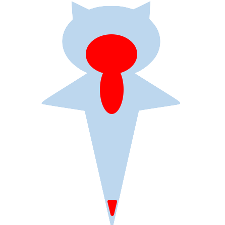

< Hello.

[[EN](#What's-CLIONE)] [[JP](#CLIONEとは)]

# What's CLIONE
CLIONE is a code clone maintenance assist bot. 
CLIONE execution is triggered by Pull Requests, and it notifies inconsistently modified or newly added clone sets between the pull request.

## How to use
1. Click [here](https://github.com/apps/clione-bot) to register your GitHub account and repository to which you want to apply CLIONE.
2. Create `.clione/config.toml` in your project.
3. Edit `config.toml` by refering [Settings](#Settings)
4. Configuration is over. Let's create a pull request.

## Settings
`simirality` is integer type, and others are string type.
Simple example is [here](./.clione/config.toml).

|Name|Description|Default value|
|:--:|:--:|:--:|
|src|Relative path of source directory. ex: `src/main/java`|`src`|
|lang|Programming language. Following languages are selectable. `java`, `kotlin`,`python`, `cpp`|`java`|
|clone_detector|Clone Detector. Following detectors are selectable. Parentheses are the supported languages. `NiCad(java, python)`,`SourcererCC(java, kotlin, python, cpp)`|`NiCad`|
|granularity|Granularity of clones. Followings are selectable. `method`,`block`|`block`|
|similarity|Similarity of clones. If you enter an integer d between 0 and 10, the clones are detected with a similarity of 10*d%.|`8`|

___

# CLIONEとは

CLIONEはコードクローン保守支援ボットです． 
プルリクエスト作成をトリガーとして実行され，プルリクエスト内で行われた変更の前後で，一貫修正されていないクローンセットや，新しく追加されたクローンセットを通知します．

## 使い方
1. [こちら](https://github.com/apps/clione-bot) からGitHubアカウントと適用したいリポジトリを登録してください．
2. CLIONEを利用したいプロジェクトに内に`.clione/config.toml`ファイルを作成してください．
3. [設定](#設定)を参考に`config.toml`を編集してください．
4. 設定は以上です．あとはプルリクエストを作成してみてください．

## 設定
`similarity`は整数型，それ以外は文字列型で記述してください． 
tomlの例は[こちら](./.clione/config.toml)

|名前|説明|デフォルト値|
|:--:|:--:|:--:|
|src|ソースファイルを含むディレクトリへの相対パス 例: `src/main/java`|`src`|
|lang|プログラミング言語．以下を選択できます． `java`, `kotlin`, `python`, `cpp`|`java`|
|clone_detector|クローン検出器．以下を選択できます．カッコ内は対応言語です． `NiCad(java, python)`,`SourcererCC(java, kotlin, python, cpp)`|`NiCad`|
|granularity|検出するクローンの粒度．以下を選択できます． `method`,`block`|`block`|
|similarity|検出するクローンの類似度．0~10までの整数値dを入力すると，10*d%の類似度でクローンを検出します．|`8`|
